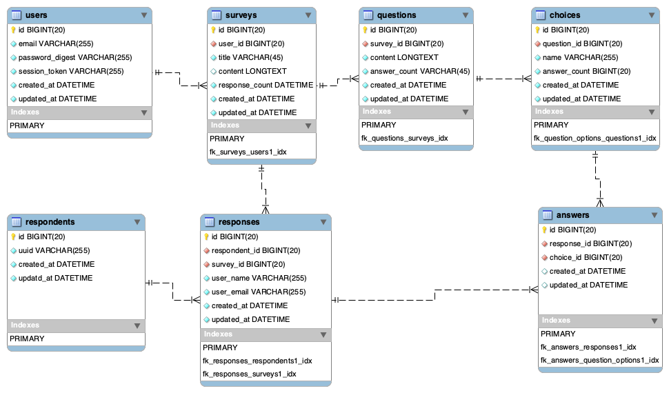

# survey_app

[Frontend README.md](survey_frontend/README.md)
[Backend README.md](survey_backend/README.md)

# API documentation

See this [API doc README.md](docs/README.md), which explains the setup of API documentation.
To see the built API doc, please see `docs/slate/build` directory.

※ The current API doc is WIP.

# ER diagram

# WIP

- [ ] update feature of survey
- [ ] pagination
- [ ] form validation
- [ ] deployment settings
